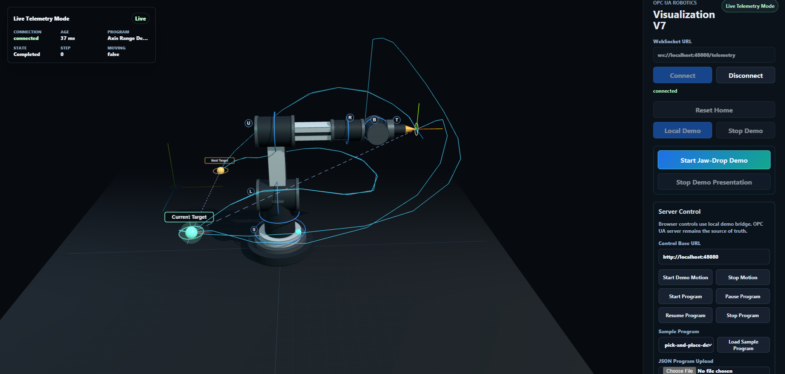
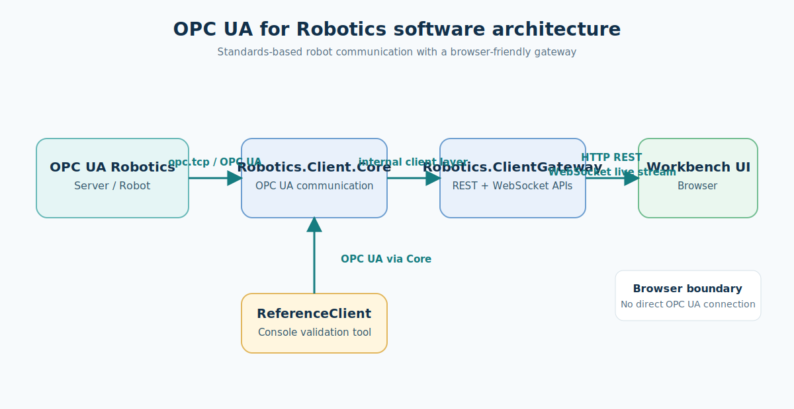

# OPC UA for Robotics Reference Implementation



This repository is a standards-focused reference implementation and demonstration environment for OPC UA for Robotics. It demonstrates how browser-based robotics workbench software can interact with simulated or real robot systems through OPC UA Robotics, without vendor-specific robot APIs.

## Why this project exists

The project provides a practical, vendor-independent path for robot communication:

- Standards-based discovery, state reading, method calls, and live updates.
- Support for simulated systems, with a path toward real robot systems.
- A useful validation environment for tradeshow demonstrations and vendor interoperability testing.
- No vendor-specific SDK in the browser; the browser communicates with the gateway.

## Software architecture



The robot or reference server exposes OPC UA Robotics. `Robotics.Client.Core` performs OPC UA communication, `Robotics.ClientGateway` exposes HTTP and WebSocket APIs, and `Robotics.Workbench` runs in the browser. `Robotics.ReferenceClient` is a console validation tool that also uses `Robotics.Client.Core`. The browser is not the OPC UA client.

## What this project contains

- `Robotics.ReferenceServer` — simulated OPC UA Robotics reference server.
- `Robotics.ReferenceClient` — console validation client.
- `Robotics.Client.Core` — OPC UA session, discovery, snapshots, and call behavior.
- `Robotics.ClientGateway` — REST and WebSocket gateway APIs.
- `Robotics.Workbench` — browser-based responsive workbench UI.
- `generated/opcua-robotics` — generated OPC UA Robotics model code and related artifacts.
- `docs/images` — demonstration and architecture visuals.

## Current capabilities

- Simulated OPC UA Robotics reference server.
- `MotionDeviceSystem`, `Controller`, `MotionDevice`, `Axes`, and `PowerTrains`.
- `SystemOperation` and `TaskControlOperation`.
- Runtime discovery and method metadata discovery.
- Safe OPC UA `Session.Call` usage with exact OPC UA `StatusCode` reporting.
- State and equipment snapshots.
- WebSocket live stream.
- Responsive browser Workbench.
- iPad/tablet access on the same Wi-Fi network.
- Early multi-robot gateway registry support.

## Standards discipline

The client should not guess information model semantics, state-machine semantics, method signatures, `ReferenceTypes`, `ModellingRules`, instance `NodeIds`, or vendor-specific naming conventions.

It should use the OPC UA Robotics specification, local NodeSets and generated-code truth, the server-provided runtime model, runtime discovery, and method metadata. This repository is a reference implementation and interoperability demonstration. It does not claim certification, full conformance testing, or implementation of every OPC UA Robotics feature.

## Repository structure

```text
src/
  Robotics.ReferenceServer/
  Robotics.ReferenceClient/
  Robotics.Client.Core/
  Robotics.ClientGateway/
  Robotics.Workbench/
generated/
  opcua-robotics/
docs/
  images/
```

## Requirements

- .NET 10 SDK
- Node.js
- npm
- Git
- Optional: UaExpert or another OPC UA inspection tool

## Getting started

```powershell
git clone https://github.com/umati/OPC-UA-for-Robotics-Reference-Implementation.git
cd OPC-UA-for-Robotics-Reference-Implementation
dotnet build
cd src\Robotics.Workbench
npm install
npm run build
cd ..\..
```

## Running the local demo

Start three PowerShell terminals.

**Terminal 1 — reference server**

```powershell
dotnet run --project src/Robotics.ReferenceServer/Robotics.ReferenceServer.csproj
```

Endpoint: `opc.tcp://localhost:4840/RoboticsReferenceServer`

**Terminal 2 — gateway**

```powershell
dotnet run --project src/Robotics.ClientGateway/Robotics.ClientGateway.csproj --urls http://localhost:5080
```

**Terminal 3 — Workbench**

```powershell
cd src\Robotics.Workbench
npm run dev -- --port 5174
```

Open `http://localhost:5174` and set the gateway field to `http://localhost:5080`.

## Running from an iPad or tablet on the same Wi-Fi

Find the laptop address with `ipconfig`. Start the gateway and Vite so they listen on the network interface:

```powershell
ipconfig
dotnet run --project src/Robotics.ClientGateway/Robotics.ClientGateway.csproj --urls http://0.0.0.0:5080
cd src\Robotics.Workbench
npm run dev -- --host 0.0.0.0 --port 5174
```

Open `http://YOUR_LAPTOP_IP:5174` on the iPad and set the gateway field to `http://YOUR_LAPTOP_IP:5080`. The CORS configuration must include `http://YOUR_LAPTOP_IP:5174`. Windows Firewall may need inbound rules for ports 5080 and 5174.

## Gateway API overview

```text
GET /health
GET /api/opcua/status
GET /api/robotics/discovery
GET /api/robotics/snapshot?selection=all
GET /api/robotics/snapshot?selection=states
GET /api/robotics/snapshot?selection=equipment
GET /ws/robotics/live
```

## Method-call endpoints

System operation:

```text
POST /api/robotics/system/get-ready
POST /api/robotics/system/start
POST /api/robotics/system/stop
POST /api/robotics/system/stand-down
```

Task control operation:

```text
POST /api/robotics/task/load-by-name
POST /api/robotics/task/start
POST /api/robotics/task/stop
POST /api/robotics/task/reset-to-program-start
POST /api/robotics/task/unload-program
```

HTTP success does not mean OPC UA `Good`. The response carries the exact OPC UA call `StatusCode`; non-Good statuses remain visible and useful for diagnosis and interoperability testing.

Example PowerShell calls:

```powershell
Invoke-RestMethod -Method Post http://localhost:5080/api/robotics/system/get-ready -ContentType "application/json" -Body '{}' | ConvertTo-Json -Depth 20
Invoke-RestMethod -Method Post http://localhost:5080/api/robotics/task/load-by-name -ContentType "application/json" -Body '{ "programName": "axis-range-demo" }' | ConvertTo-Json -Depth 20
Invoke-RestMethod -Method Post http://localhost:5080/api/robotics/task/start -ContentType "application/json" -Body '{}' | ConvertTo-Json -Depth 20
```

## Live WebSocket stream

```powershell
wscat -c "ws://localhost:5080/ws/robotics/live?selection=all&sendInitialSnapshot=true"
```

## Multi-robot registry

The gateway has early multi-robot registry support:

```text
GET /api/robots
GET /api/robots/{robotId}/status
GET /api/robots/{robotId}/discovery
GET /api/robots/{robotId}/snapshot?selection=all|states|equipment
```

Example `appsettings` configuration:

```json
"Robots": [
  {
    "id": "reference-robot",
    "displayName": "Reference Robot Server",
    "endpointUrl": "opc.tcp://localhost:4840/RoboticsReferenceServer",
    "enabled": true
  }
]
```

If `Robots` is empty or absent, the registry can create a default robot from `OpcUa:EndpointUrl`. Robot-scoped discovery and snapshots are available, but command execution and WebSocket streaming may still use the default/single robot unless robot-scoped command endpoints have been added.

## Vendor testing guide

1. Start a vendor OPC UA Robotics server.
2. Expose its OPC UA Robotics model.
3. Configure the gateway endpoint or `Robots` registry.
4. Start the gateway and Workbench.
5. Verify status, discovery, snapshot, method calls, and WebSocket live updates.
6. Send the evidence back to the project.

Please report:

1. Endpoint URL.
2. Security policy and mode.
3. Simulated or real robot.
4. Result of `/api/opcua/status` or robot-scoped status.
5. Result of discovery.
6. Result of snapshot.
7. Method-call results.
8. A WebSocket sample.
9. Non-Good `StatusCode` values.
10. Missing methods or unexpected model structures.

## Development commands

```powershell
dotnet build
cd src\Robotics.Workbench
npm run build
npm run dev -- --port 5174
```

## Current limitations

- Reference/demo stack, not a certification tool.
- Full fleet UI is still under development.
- Simultaneous multi-robot command orchestration is not yet complete.
- Robot-scoped WebSocket aggregation is not yet complete.
- Certificate handling is development-oriented.
- Security policy/mode selector UI is not yet implemented.
- Vendor differences are intentionally not hidden.
- Missing methods should be reported, not faked.

## Roadmap

- Robot-scoped command endpoints.
- Robot selector in Workbench.
- Multi-robot live streams.
- Fleet dashboard.
- Simultaneous command orchestration with per-robot results.
- Certificate trust workflow.
- Security policy/mode selection.
- Tradeshow-ready multi-robot choreography.

## License

See [LICENSE](LICENSE).
