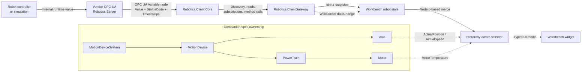

# OPC UA Robotics Workbench Data Flow

> How a live value travels from a robot or simulation to a widget in the browser, and how a developer can trace it back to its source.



## Purpose

The Workbench is not a generic dashboard that displays arbitrary values. It is a standards-led client for OPC UA Robotics systems.

Every visible value must remain traceable through the full chain:

```text
Original source
→ OPC UA server node
→ Robotics.Client.Core
→ Robotics.ClientGateway
→ REST snapshot or WebSocket dataChange
→ Workbench robot state
→ hierarchy-aware selector
→ visual widget
```

That traceability is essential for three reasons:

- **Correctness:** the UI must display the right value for the right component.
- **Interoperability:** the client must work across different vendor implementations without hardcoded instance NodeIds.
- **Diagnostics:** a suspicious value must be traceable back to the server node and ultimately to the original robot or simulation variable.

---

## Architectural layers

### 1. Robot controller or simulation

This is where the value originates.

Examples include:

- axis encoder feedback
- actual axis speed
- motor temperature
- controller operating mode
- state-machine state
- a simulation variable in the reference server

For a real robot, a value may originate in the controller or servo-drive runtime. In the reference implementation, it may originate in the simulator.

The Workbench never reads this internal value directly.

---

### 2. Vendor OPC UA Robotics Server

The vendor server maps internal values into an OPC UA Robotics address space.

A value is exposed as an OPC UA Variable with runtime information such as:

- `NodeId`
- `BrowseName`
- `DisplayName`
- data type
- value
- `StatusCode`
- source timestamp
- server timestamp
- engineering unit
- range information, where available

The exact NodeId and instance names are vendor-specific. The client therefore discovers them at runtime rather than hardcoding them.

The server also establishes ownership within the Robotics information model. For example:

```text
MotionDeviceSystem
└─ MotionDevice
   ├─ Axis
   │  ├─ ActualPosition
   │  └─ ActualSpeed
   └─ PowerTrain
      └─ Motor
         └─ MotorTemperature
```

Ownership matters. `ActualPosition` belongs to a particular axis. `MotorTemperature` belongs to a particular motor. They are not generic robot-level values.

---

### 3. Robotics.Client.Core

`Robotics.Client.Core` is the OPC UA client layer.

Its responsibilities include:

- application and certificate configuration
- endpoint selection
- secure channel and session creation
- namespace URI resolution
- runtime browsing and discovery
- reading values
- creating subscriptions and monitored items
- discovering method metadata
- invoking methods with runtime validation

Namespace indexes are resolved at runtime. A Robotics namespace might be `ns=4` on one server and `ns=7` on another, so the client must not rely on a fixed namespace index.

---

### 4. Robotics.ClientGateway

The gateway exposes browser-friendly APIs while preserving OPC UA semantics.

It provides:

- robot registry and endpoint resolution
- robot-scoped discovery
- robot-scoped snapshots
- robot-scoped command endpoints
- robot-scoped WebSocket live streams

The gateway does not invent values or reinterpret bad quality as good quality. It forwards the exact OPC UA value, `StatusCode`, and timestamps.

For a multi-vendor deployment, the registry provides the mapping:

```text
robotId → endpointUrl
```

Example:

```json
{
  "id": "vendor-a-robot",
  "displayName": "Vendor A Robot",
  "endpointUrl": "opc.tcp://192.168.50.21:4840/RoboticsServer",
  "enabled": true
}
```

---

### 5. Robotics Workbench

The Workbench is the browser UI.

For every configured robot, it maintains isolated state for:

- connection status
- discovery data
- snapshot data
- live stream status
- command results
- errors and diagnostics

Live updates from Robot A must update only Robot A. Robot B must remain unaffected.

The Workbench then uses hierarchy-aware selectors to convert raw runtime values into UI-specific models for:

- robot identity
- state-machine visualization
- axis widgets
- motor widgets
- safety and control indicators

---

# End-to-end example: Axis 2 ActualPosition

## Step 1: Original source

The robot controller or simulator has an internal value:

```text
Axis 2 actual position = 42.7°
```

This is the original source of truth.

---

## Step 2: Server binding

The vendor server binds that internal value to an OPC UA Variable belonging to Axis 2.

Conceptually:

```text
MotionDevice
└─ Axis 2
   └─ ActualPosition
```

A runtime node may expose:

```text
NodeId: ns=5;s=VendorRobot/Axis2/ActualPosition
Value: 42.7
StatusCode: Good
EngineeringUnit: °
```

The exact NodeId is vendor-specific and must not be hardcoded in the client.

---

## Step 3: Endpoint resolution

The gateway resolves the logical robot ID:

```text
vendor-a-robot
```

to its OPC UA endpoint:

```text
opc.tcp://192.168.50.21:4840/RoboticsServer
```

This ensures that the value is read from the correct vendor server.

---

## Step 4: OPC UA session and discovery

`Robotics.Client.Core` opens a session and discovers the runtime model.

It establishes that the node belongs to:

```text
Vendor A Robot
→ MotionDevice
→ Axis 2
→ ActualPosition
```

This prevents broad string matching such as “find the first value containing Position”.

---

## Step 5: Initial snapshot

When the Workbench loads or refreshes, it calls:

```http
GET /api/robots/vendor-a-robot/snapshot?selection=all
```

The gateway performs runtime discovery and reads the selected nodes.

A snapshot entry conceptually contains:

```json
{
  "componentPath": "RobotArm/Axes/Axis2",
  "label": "ActualPosition",
  "nodeId": "ns=5;s=VendorRobot/Axis2/ActualPosition",
  "value": 42.7,
  "valueText": "42.7",
  "statusCode": "Good",
  "engineeringUnit": "°",
  "sourceTimestamp": "2026-07-14T15:30:01Z",
  "serverTimestamp": "2026-07-14T15:30:01Z"
}
```

This establishes the initial Workbench state.

---

## Step 6: Live subscription

The Workbench opens the robot-scoped WebSocket:

```text
/ws/robots/vendor-a-robot/live
```

The gateway creates an isolated OPC UA session and subscription for that WebSocket connection.

When the position changes from `42.7°` to `43.1°`, the OPC UA server emits a `DataChangeNotification`.

The gateway forwards a message such as:

```json
{
  "type": "dataChange",
  "robotId": "vendor-a-robot",
  "nodeId": "ns=5;s=VendorRobot/Axis2/ActualPosition",
  "label": "ActualPosition",
  "valueText": "43.1",
  "statusCode": "Good",
  "sourceTimestamp": "2026-07-14T15:30:02Z",
  "serverTimestamp": "2026-07-14T15:30:02Z"
}
```

No polling is required.

---

## Step 7: Per-robot routing

The Workbench routes the message using `robotId`.

Only the state of `vendor-a-robot` is updated.

Conceptually:

```text
robotsById
├─ vendor-a-robot  ← updated
├─ vendor-b-robot
└─ vendor-c-robot
```

This is the first isolation boundary.

---

## Step 8: Merge by NodeId

The Workbench finds the existing snapshot entry with the same `NodeId` and replaces its current value.

```text
Snapshot NodeId
=
dataChange NodeId
```

The updated value remains associated with:

```text
Vendor A
→ MotionDevice
→ Axis 2
→ ActualPosition
```

This is the second isolation boundary.

---

## Step 9: Hierarchy-aware selector

The UI selector receives the discovered axis and the latest merged runtime values.

Conceptually:

```ts
selectAxisActualPosition(axis2, snapshot)
```

The selector returns a typed UI model:

```json
{
  "componentName": "Axis 2",
  "nodeId": "ns=5;s=VendorRobot/Axis2/ActualPosition",
  "value": 43.1,
  "valueText": "43.1",
  "engineeringUnit": "°",
  "statusCode": "Good",
  "euRange": {
    "low": -170,
    "high": 170
  }
}
```

The selector is the semantic bridge between runtime data and presentation.

It must preserve:

- component ownership
- node identity
- value quality
- engineering unit
- timestamps
- optional range information

---

## Step 10: Widget rendering

The Axis widget receives the selector output and renders:

```text
Axis 2
Position: 43.1°
```

It may also render a visual arc or position indicator.

The visual representation is a UI decision. The source value, unit, quality, and ownership are not.

If `EURange` is unavailable, the UI must not invent a percentage scale. It may still show the numeric value and a neutral live indicator.

---

# MotorTemperature follows a different ownership path

`MotorTemperature` must remain associated with its owning motor.

```text
Robot
→ MotionDevice
→ PowerTrain
→ Motor
→ MotorTemperature
```

The trace is:

```text
Motor thermal source
→ OPC UA MotorTemperature node
→ Client.Core subscription
→ Gateway WebSocket
→ Workbench robot state
→ motor-specific selector
→ Motor widget
```

A robot-level summary such as:

```text
Highest motor temperature: 43 °C
```

is allowed only when clearly labelled as a UI-derived aggregation. It is not itself a companion-spec Variable.

---

# State-machine values

State-machine widgets use the same transport pipeline, but they must select the correct runtime variables.

For a human-readable active state, the UI should prefer the relevant state machine’s current-state text, such as:

```text
SystemOperationStateMachine.CurrentState.ValueAsText
```

It must not accidentally display:

- `CurrentState.Id`
- transition IDs
- enum metadata
- transition reason arrays

The flow is:

```text
Server state-machine runtime
→ CurrentState / ValueAsText node
→ snapshot or subscription
→ gateway
→ Workbench selector
→ state-machine visualization
```

The UI may then highlight:

```text
Idle   [Ready]   Executing
```

When a top-level state owns an active substate machine, the active substate should appear under its parent rather than as a peer in a flat sequence.

---

# Debugging a suspicious value

When a Workbench value looks wrong, trace it backwards in this order.

## 1. Widget

Determine:

- which component the widget represents
- which selector supplied the displayed value
- whether the widget is showing a direct runtime value or a UI-derived summary

## 2. Selector provenance

Inspect:

- selected runtime label or path
- owning component
- `NodeId`
- value text
- `StatusCode`
- engineering unit
- source and server timestamps
- match rule used by the selector

## 3. Workbench robot state

Confirm that the correct robot contains the latest merged value for the node.

## 4. REST or WebSocket payload

Check that the gateway sent:

- correct `robotId`
- correct `NodeId`
- correct value
- exact `StatusCode`
- correct timestamps

## 5. Gateway discovery

Confirm that the gateway associated the node with the correct:

- robot
- motion device
- axis
- power train
- motor
- state machine

## 6. OPC UA client session

Confirm that the session is connected to the intended endpoint and resolved the correct namespace URI.

## 7. Server address space

Use UaExpert or another OPC UA browser to verify:

- browse path
- NodeId
- current value
- `StatusCode`
- timestamps
- engineering unit
- range information

## 8. Original server binding

Finally, confirm which controller or simulation variable supplies that OPC UA node.

The complete reverse trace is:

```text
Workbench widget
← selector
← merged Workbench state
← REST snapshot or WebSocket dataChange
← OPC UA read or monitored item
← OPC UA Variable node
← server binding
← robot controller or simulation variable
```

---

# Trustworthiness checklist

A visible value is fully traceable when the following information is available:

- Robot ID
- endpoint URL
- owning component
- discovery or browse path
- NodeId
- value
- `StatusCode`
- source timestamp
- server timestamp
- engineering unit
- range, if available
- selector name or match rule
- widget that renders it

If one of these links is missing, the value may still look correct, but it is not yet robust enough for a multi-vendor interoperability demonstration.

---

# Standards truth, runtime truth, and UI decisions

Developers should keep these three categories separate.

## Official specification truth

Examples:

- an axis owns its axis-specific measurements
- a motor owns its temperature measurement
- state-machine variables have defined semantics
- OPC UA values carry `StatusCode` and timestamps

## Local/runtime truth

Examples:

- the actual NodeIds used by a vendor server
- the runtime namespace index
- which optional Variables are present
- the actual component hierarchy exposed by the server
- the current value, unit, and quality

## UI implementation decision

Examples:

- rendering a position as an arc
- showing a compact temperature bar
- calculating “highest motor temperature”
- deciding which values are prominent
- placing technical provenance behind an expandable details panel

A UI decision must never be presented as if it were a companion-spec Variable or official semantic.

---

# Recommended developer feature: provenance mode

A useful future enhancement is a developer provenance overlay.

A developer could click any widget and inspect:

- robot ID
- endpoint URL
- owning component path
- source NodeId
- current value
- `StatusCode`
- timestamps
- selector name
- gateway section
- whether the value is direct or UI-derived

This would make vendor onboarding and tradeshow troubleshooting significantly faster.

---

# Summary

The Workbench does not create robot data. It visualizes data that travels through a strict, traceable chain:

```text
Robot or simulation
→ OPC UA Robotics Server
→ Robotics.Client.Core
→ Robotics.ClientGateway
→ Workbench state
→ selector
→ widget
```

A reliable implementation preserves:

- vendor independence
- component ownership
- runtime discovery
- exact quality and timestamps
- per-robot isolation
- per-component isolation
- a clear distinction between specification semantics and UI presentation